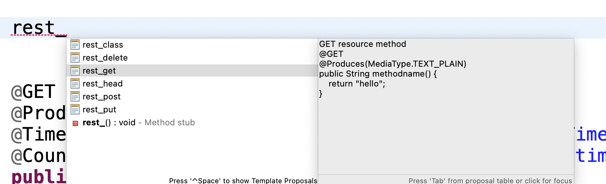
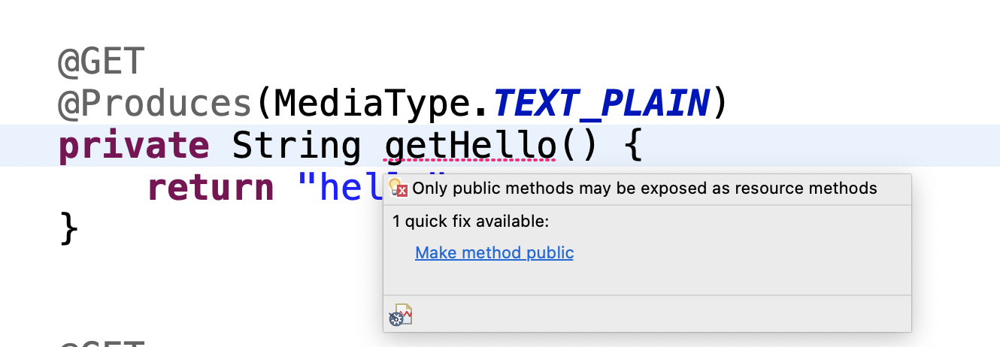

# Eclipse LSP4Jakarta - Language Server for Jakarta EE

The Eclipse LSP4Jakarta (Language Server for Jakarta EE) project provides language support capabilities for the specifications defined under the [Jakarta EE](https://jakarta.ee) umbrella. It adheres to the [language server protocol](https://github.com/Microsoft/language-server-protocol).

This project contains: 

- [jakarta.ls](/jakarta.ls) - Language Server for Jakarta EE
- [jakarta.jdt](/jakarta.jdt) - [Eclipse JDT LS](https://github.com/eclipse/eclipse.jdt.ls) extension for Eclipse LSP4Jakarta
- [jakarta.eclipse](/jakarta.eclipse) - Eclipse IDE client (for local testing) that consumes Eclipse LSP4Jakarta

# Table of Contents
- [Client IDEs](#client-ides)
- [Features](#jakarta-ee-api-language-features)
   - [Jakarta Annotations](#jakarta-annotations)
   - [Jakarta Bean Validation](#jakarta-bean-validation)
   - [Jakarta Contexts and Dependency Injection](#jakarta-contexts-and-dependency-injection)
   - [Jakarta Dependency Injection](#jakarta-dependency-injection)
   - [Jakarta JSON Binding](#jakarta-json-binding)
   - [Jakarta JSON Processing](#jakarta-json-processing)
   - [Jakarta Persistence](#jakarta-persistence)
   - [Jakarta RESTful Web Services](#jakarta-restful-web-services)
   - [Jakarta Servlet](#jakarta-servlet)
   - [Jakarta Transactions](#jakarta-transactions)
   - [Jakarta WebSocket](#jakarta-websocket)
- [Contributing](#Contributing)
- [License](#license)
- [Feedback](#Feedback)
--- 
## Client IDEs

Eclipse LSP4Jakarta is consumed by the following client IDEs.
-  Eclipse IDE with [Liberty Tools for Eclipse](https://github.com/OpenLiberty/liberty-tools-eclipse#welcome-to-the-liberty-tools-for-eclipse-project)
-  Visual Studio Code with [Liberty Tools for Visual Studio Code](https://github.com/OpenLiberty/liberty-tools-vscode#liberty-tools-for-visual-studio-code)
-  IntelliJ IDEA with [Liberty Tools for IntelliJ IDEA](https://github.com/OpenLiberty/liberty-tools-intellij#liberty-tools-for-intellij-idea)

Submit a PR to have your tools that use Eclipse LSP4Jakarta listed.

## Features

The language features currently offered by Eclipse LSP4Jakarta to Jakarta EE APIs are code snippets, diagnostics, and quick-fixes.

Code snippets help you quickly generate common blocks of code.

Diagnostics indicate incorrect API usage and suggest associated quick-fixes to correct API usage.

The following is a list of Eclipse LSP4Jakarta language features offered for each [Jakarta EE API](https://jakarta.ee/specifications/). Language features will only be delivered for a given Jakarta EE API if that API is found on the project's class path. Eclipse LSP4Jakarta is currently targeting Jakarta EE 9/9.1 (jakarta.* namespace). 
 
If you would like to see language feature assistance for a Jakarta EE API that is not yet listed here, please open an issue on the [issue tracker](https://github.com/eclipse/lsp4jakarta/issues).

### Jakarta Annotations

Eclipse LSP4Jakarta provides the following [Jakarta Annotations diagnostics](./jakarta.jdt/org.eclipse.lsp4jakarta.jdt.core/src/main/java/org/eclipse/lsp4jakarta/jdt/core/annotations/).

| Diagnostic description | Severity | Associated quick-fixes |
| --------- | ----- | ------------ |
| The @Generated annotation must define the 'date' attribute following the ISO 8601 standard. | Error | N/A |
| The @Resource annotation must define the attribute 'type' when applied on a class. | Error | Add type to  jakarta.annotation.Resource |
| The @Resource annotation must define the attribute 'name' when applied on a class. | Error | Add name to  jakarta.annotation.Resource |
| A method with the @PostConstruct annotation must be void | Error | Change return type to void |
| A method with the @PreDestroy annotation must not be static. | Error | N/A | 
| A method with the @PostConstruct/@PreDestroy annotation must not have any parameters. | Error |  Remove @PostConstruct/@PreDestroy OR  Remove all parameters | 
| A method with the @PostConstruct/@PreDestroy annotation must not throw checked exceptions. | Warning | N/A |

### Jakarta Bean Validation

Eclipse LSP4Jakarta provides the following [Jakarta Bean Validation snippets](./jakarta.ls/src/main/resources/bean-validation.json).

| Snippet prefix | Description |
| --------- | ------------ |
| @Email | Email address constraint, which validates a well-formed email address |

Eclipse LSP4Jakarta provides the following [Jakarta Bean Validation diagnostics](./jakarta.jdt/org.eclipse.lsp4jakarta.jdt.core/src/main/java/org/eclipse/lsp4jakarta/jdt/core/beanvalidation/).

| Diagnostic description | Severity | Associated quick-fixes |
| --------- | ----- | ------------ |
| Constraint annotations are not allowed on static fields or methods. | Error | Remove the constraint annotation OR Remove the static modifier |
| The @AssertTrue/@AssertFalse annotation can only be used on boolean and Boolean type fields or methods. | Error | Remove @AssertTrue/@AssertFalse |
| The @DecimalMax/@DecimalMin/@Digits annotation can only be used on: BigDecimal, BigInteger, CharSequence, byte, short, int, long (and their respective wrappers) type fields or methods.| Error | Remove @DecimalMax/@DecimalMin/@Digits |
| The @Email annotation can only be used on String and CharSequence type fields or methods. | Error | Remove @Email |
| The @Future/@FutureOrPresent/@Past/@PastOrPresent annotation can only be used on: Date, Calendar, Instant, LocalDate, LocalDateTime, LocalTime, MonthDay, OffsetDateTime, OffsetTime, Year, YearMonth, ZonedDateTime, HijrahDate, JapaneseDate, JapaneseDate, MinguoDate and ThaiBuddhistDate type fields or methods. | Error | Remove @Future/@FutureOrPresent/@Past/@PastOrPresent |
| The @Min/@Max annotation can only be used on BigDecimal, BigInteger, byte, short, int, long (and their respective wrappers) type fields or methods. | Error | Remove @Min/@Max |
| The @Negative/@NegativeOrZero/@Positive/@PositiveOrZero annotation can only be used on BigDecimal, BigInteger, byte, short, int, long, float, double (and their respective wrappers) type fields or methods. | Error | Remove @Negative/@NegativeOrZero/@Positive/@PositiveOrZero |
| The @NotBlank/@Pattern annotation can only be used on String and CharSequence type fields or methods. | Error | Remove @NotBlank/@Pattern |

### Jakarta Contexts and Dependency Injection

Eclipse LSP4Jakarta provides the following [Jakarta Contexts and Dependency Injection diagnostics](./jakarta.jdt/org.eclipse.lsp4jakarta.jdt.core/src/main/java/org/eclipse/lsp4jakarta/jdt/core/cdi/).

| Diagnostic description | Severity | Associated quick-fixes |
| --------- | ----- | ------------ |
| A bean constructor or a method annotated with @Inject cannot have parameter(s) annotated with @Disposes/@Observes/@ObservesAsync | Error | Remove @Inject OR Remove the '@Disposes/@Observes/@ObservesAsync' modifier from parameter 'parameter_name' | 
| A producer method cannot have parameter(s) annotated with  @Disposes/@Observes/@ObservesAsync | Error | Remove @Produces OR Remove the '@Disposes/@Observes/@ObservesAsync' modifier from parameter 'parameter_name' |
| The @Disposes annotation must not be defined on more than one parameter of a method. | Error | N/A |
| Managed bean class of generic type must have scope @Dependent | Error | Replace current scope with @Dependent |
| The  @Dependent annotation must be the only scope defined by a managed bean with a non-static public field. | Error | Replace current scope with @Dependent | 
| The @Inject annotation must define a managed bean constructor that takes parameters, or the managed bean must resolve to having a no-arg constructor instead. | Error | Insert @Inject OR Add a no-arg protected constructor to this class OR Add a no-arg public constructor to this class. |
| The @Produces and @Inject annotations must not be used on the same field or property. | Error | Remove @Produces OR @Inject |
| Scope type annotations must be specified by a managed bean class/producer field or method at most once. | Error | N/A |

### Jakarta Dependency Injection

Eclipse LSP4Jakarta provides the following [Jakarta Dependency Injection diagnostics](./jakarta.jdt/org.eclipse.lsp4jakarta.jdt.core/src/main/java/org/eclipse/lsp4jakarta/jdt/core/di/).

| Diagnostic description | Severity | Associated quick-fixes |
| --------- | ----- | ------------ |
| The @Inject annotation must not define a final method. | Error | Remove @Inject OR Remove the 'final' modifier from this field | 
| The @Inject annotation must not define a final/abstract/static method. | Error | Remove @Inject OR Remove the 'final/asbtract/static' modifier from this method |
| The @Inject annotation must not define a generic method. | Error | Remove @Inject |
| The @Inject annotation must not define more than one constructor. | Error | Remove @Inject |

### Jakarta JSON Binding

Eclipse LSP4Jakarta provides the following [Jakarta JSON Binding diagnostics](./jakarta.jdt/org.eclipse.lsp4jakarta.jdt.core/src/main/java/org/eclipse/lsp4jakarta/jdt/core/jsonb/).

| Diagnostic description | Severity | Associated quick-fixes |
| --------- | ----- | ------------ |
| Only one constructor or static factory method can be annotated with @JsonbCreator in a given class. | Error | Remove @JsonbCreator |
| When a class field is annotated with @JsonbTransient, this field, getter or setter must not be annotated with other JSON Binding annotations. | Error |  Remove @JsonbTransient OR Remove @JsonbProperty/@JsonbAnnotation |
| When an accessor is annotated with @JsonbTransient, its field or the accessor must not be annotated with other JSON Binding annotations. | Error | Remove @JsonbTransient OR Remove @JsonbProperty/@JsonbAnnotation |

### Jakarta JSON Processing

Eclipse LSP4Jakarta provides the following [Jakarta JSON Processing diagnostics](./jakarta.jdt/org.eclipse.lsp4jakarta.jdt.core/src/main/java/org/eclipse/lsp4jakarta/jdt/core/jsonp/).

| Diagnostic description | Severity | Associated quick-fixes |
| --------- | ----- | ------------ |
| Json.createPointer target must be a sequence of '/' prefixed tokens or an empty String | Error | N/A |

### Jakarta Persistence

Eclipse LSP4Jakarta provides the following [Jakarta Persistence snippets](./jakarta.ls/src/main/resources/persistence.json).

| Snippet prefix | Description |
| --------- | ------------ |
| persist_context | Entity manager injection and associated persistence context |
| persist_context_extended | Entity manager injection with extended persistence context |
| persist_context_extended_unsync | Entity manager injection with extended, unsynchronized persistence context |
| persist_entity | Generic persistence entity model. Only available in an empty file. |

Eclipse LSP4Jakarta provides the following [Jakarta Persistence diagnostics](./jakarta.jdt/org.eclipse.lsp4jakarta.jdt.core/src/main/java/org/eclipse/lsp4jakarta/jdt/core/persistence/).

| Diagnostic description | Severity | Associated quick-fixes |
| --------- | ----- | ------------ |
| A class using the @Entity annotation must contain a public or protected constructor with no arguments. | Error | Add a no-arg protected constructor to this class OR Add a no-arg public constructor to this class |
| A class using the @Entity annotation must not be final. | Error | Remove the 'final' modifier from this class |
| A class using the @Entity annotation cannot contain any methods that are declared final | Error | Remove the 'final' modifier from this method | 
| A class using the @Entity annotation cannot contain any persistent instance variables that are declared final | Error | Remove the 'final' modifier from this field |
| @MapKeyClass and @MapKey annotations cannot be used on the same field or property | Error | Remove @MapKeyClass OR Remove @MapKey |
| A field with multiple @MapKeyJoinColumn annotations must specify both the name and referencedColumnName attributes in the corresponding @MapKeyJoinColumn annotations. | Error | Add the missing attributes to the @MapKeyJoinColumn annotation | 

### Jakarta RESTful Web Services

Eclipse LSP4Jakarta provides the following [Jakarta RESTful Web Services snippets](./jakarta.ls/src/main/resources/restfulWs.json).

| Snippet prefix | Description |
| --------- | ------------ |
| rest_class | Resource class with GET resource method. Only available in an empty file. |
| rest_get | GET resource method |
| rest_post | POST resource method |
| rest_put | PUT resource method |
| rest_delete | DELETE resource method |
| rest_head | HEAD resource method |

Eclipse LSP4Jakarta provides the following [Jakarta RESTful Web Services diagnostics](./jakarta.jdt/org.eclipse.lsp4jakarta.jdt.core/src/main/java/org/eclipse/lsp4jakarta/jdt/core/jax_rs/).

| Diagnostic description | Severity | Associated quick-fixes |
| --------- | ----- | ------------ |
| Resource methods cannot have more than one entity parameter. | Error | Remove all entity parameters except 'entity_param_name' | 
| Provider/Root resource classes are instantiated by the JAX-RS runtime and MUST have a public constructor. | Error | Make constructor public OR Add a no-arg public constructor to this class |
| Only public methods can be exposed as resource methods. | Error | Make method public |
| This constructor is unused, as root resource classes will only use the constructor with the most parameters. | Warning | N/A |
| Multiple constructors have the same number of parameters, it might be ambiguous which constructor is used. | Warning | N/A | 

### Jakarta Servlet

Eclipse LSP4Jakarta provides the following [Jakarta Servlet snippets](./jakarta.ls/src/main/resources/servlet.json). All these snippets are only available in an empty file.

| Snippet prefix | Description |
| --------- | ------------ |
| servlet_generic | Generic protocol independent servlet |
| servlet_doget | HTTPServlet with GET request |
| servlet_dopost | HTTPServlet with POST request |
| servlet_webfilter | Servlet WebFilter |

Eclipse LSP4Jakarta provides the following [Jakarta Servlet diagnostics](./jakarta.jdt/org.eclipse.lsp4jakarta.jdt.core/src/main/java/org/eclipse/lsp4jakarta/jdt/core/servlet/).

| Diagnostic description | Severity | Associated quick-fixes |
| --------- | ----- | ------------ |
| Annotated classes with @WebServlet must extend the HttpServlet class. | Error | Let 'class_name' extend 'HttpServlet' |
| The @WebServlet annotation must define the attribute 'urlPatterns' or 'value'. | Error | Add the 'value' attribute to @WebServlet OR Add the 'urlPatterns' attribute to @WebServlet |

### Jakarta Transactions

Eclipse LSP4Jakarta provides the following [Jakarta Transactions snippets](./jakarta.ls/src/main/resources/transactions.json).

| Snippet prefix | Description |
| --------- | ------------ |
| tx_user_inject | Initializes a UserTransaction object via injection |
| tx_user_jndi | Initializes a UserTransaction object via JNDI lookup |
| @Transactional | Transactional annotation with rollbackOn and dontRollbackOn |

### Jakarta WebSocket

Eclipse LSP4Jakarta provides the following [Jakarta WebSocket diagnostics](./jakarta.jdt/org.eclipse.lsp4jakarta.jdt.core/src/main/java/org/eclipse/lsp4jakarta/jdt/core/websocket/).

| Diagnostic description | Severity | Associated quick-fixes |
| --------- | ----- | ------------ |
| Parameters of type String, any Java primitive type, or boxed version thereof must be annotated with @PathParams. | Error | Insert @PathParam |
| Classes annotated with @ServerEndpoint or @ClientEndpoint must have only one @OnMessage annotated method for each of the native WebSocket message formats: text, binary and pong. | Error | N/A |
| Invalid parameter type. When using @OnOpen, parameter must be of type: jakarta.websocket.EndpointConfig, jakarta.websocket.Session, annotated with @PathParams and of type String or any Java primitive type or boxed version thereof. | Error | N/A |
| Invalid parameter type. When using @OnClose, parameter must be of type: jakarta.websocket.CloseReason, jakarta.websocket.Session, annotated with @PathParams and of type String or any Java primitive type or boxed version thereof. | Error | N/A | 
| Server endpoint paths must not use the same variable more than once in a path. | Error | N/A | 
| Server endpoint paths must be a URI-template (level-1) or a partial URI. | Error | N/A |
| Server endpoint paths must start with a leading '/'. | Error | N/A |
| Server endpoint paths must not contain the sequences '/../', '/./' or '//'. | Error | N/A |

## Contributing

See the [DEVELOPING](./DEVELOPING.md) and [CONTRIBUTING](./CONTRIBUTING.md) documents for more details.

## License

Eclipse Public License - v 2.0 See [LICENSE](./LICENSE) file.

## Feedback

Please report bugs, issues and feature requests by creating a [GitHub issue](https://github.com/eclipse/lsp4jakarta/issues).
